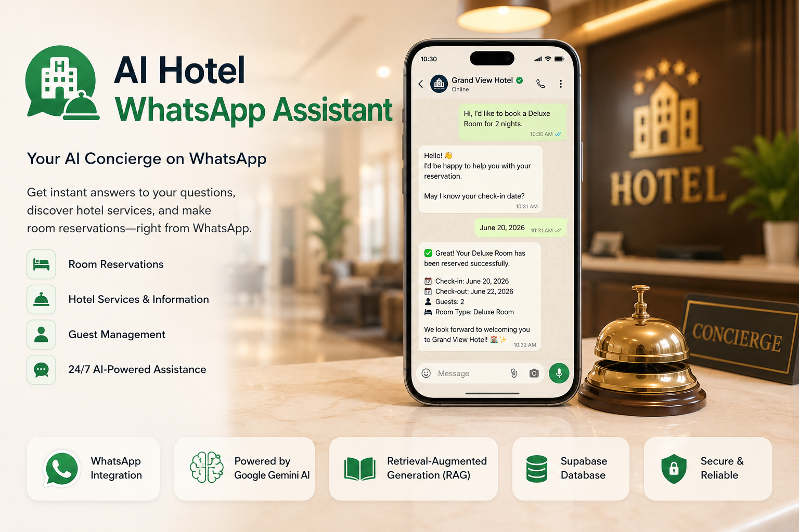
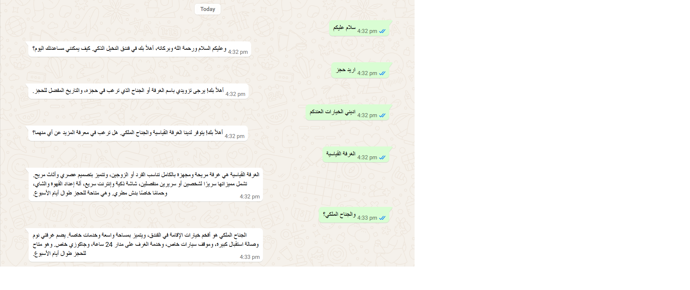
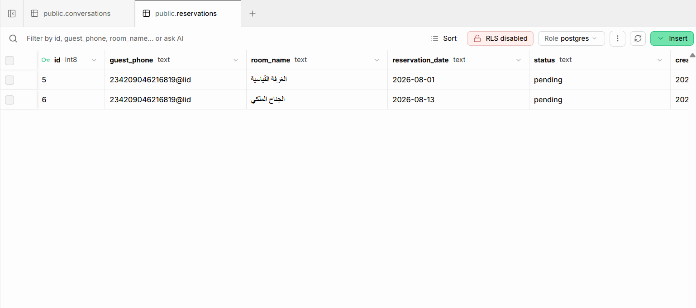
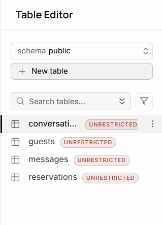
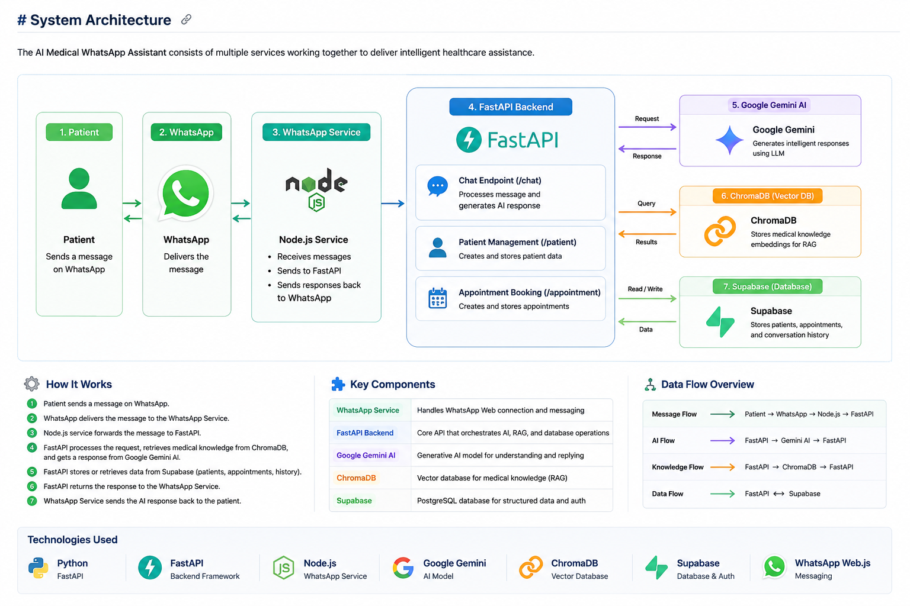

#  AI Hotel WhatsApp Assistant

<p align="center">
  
</p>


An AI-powered hotel concierge that enables guests to communicate with a hotel directly through WhatsApp.

The system uses Google's Gemini AI together with Retrieval-Augmented Generation (RAG) to answer guest questions, provide hotel information, and create room reservations automatically.

This project demonstrates how Large Language Models (LLMs), Retrieval-Augmented Generation (RAG), and WhatsApp automation can be combined to build an intelligent hotel concierge capable of answering guest inquiries, providing hotel information, and managing room reservations through natural conversations.

---

# Features

-  AI-powered hotel concierge
-  WhatsApp integration
-  Google Gemini AI
-  Retrieval-Augmented Generation (RAG)
-  Room reservation
-  Guest management
-  Hotel knowledge base
-  Supabase database
-  FastAPI backend
-  Conversation history

---

# Tech Stack

| Category | Technologies |
|----------|--------------|
| Backend | Python, FastAPI |
| AI | Google Gemini, LangChain |
| Vector Database | ChromaDB |
| Database | Supabase |
| Messaging | Node.js, WhatsApp Web.js |

---

# Project Structure

```text
hotel-ai-whatsapp-agent/

├── agent-service/
│   ├── agent/
│   ├── app/
│   ├── rag/
│   ├── tools/
│   ├── schemas/
│   ├── knowledge/
│   └── requirements.txt
│
├── whatsapp-service/
│   ├── index.js
│   ├── package.json
│   └── package-lock.json
│
└── README.md
```

---

# System Workflow

1. Guest sends a WhatsApp message.
2. WhatsApp Service receives the message.
3. FastAPI backend processes the request.
4. RAG retrieves relevant hotel knowledge.
5. Gemini AI generates an intelligent response.
6. Guest receives the answer instantly.
7. If needed, a room reservation is automatically created and stored in Supabase.

---

# Installation

## Clone the repository

```bash
git clone https://github.com/amgadnazar/hotel-ai-whatsapp-agent.git
```

## Backend

```bash
cd agent-service

pip install -r requirements.txt
```

Run

```bash
uvicorn app.main:app --reload
```

---

## WhatsApp Service

```bash
cd whatsapp-service

npm install

node index.js
```

---

# API Documentation

The backend is built using **FastAPI** and exposes RESTful APIs for guest management, AI chat, and room reservation.

## Available Endpoints

| Method | Endpoint | Description |
|--------|----------|-------------|
| GET | `/` | Health check endpoint |
| POST | `/chat` | Send a message to the AI assistant |
| POST | `/guest` | Create a new guest |
| POST | `/reservation` | Create a new reservation |

---

## Base URL

```
http://localhost:8000
```

---

## Health Check

Returns the API status.

### Request

```http
GET /
```

### Response

```json
{
  "status": "running"
}
```

---

## AI Chat

Send a guest message to the AI assistant.

### Request

```http
POST /chat
```

### Body

```json
{
  "phone": "+201234567890",
  "text": "I'd like to reserve a Deluxe Room for tomorrow."
}
```

### Response

```json
{
  "reply": "Your reservation request has been received."
}
```

---

## Create Guest

Creates a new guest record.

### Request

```http
POST /guest
```

### Body

```json
{
  "phone": "+201234567890",
  "name": "John Doe",
  "age": 28,
  "gender": "Male"
}
```

### Response

```json
{
  "message": "Guest created successfully"
}
```

---

## Create Reservation

Creates a new reservation manually.

### Request

```http
POST /reservation
```

### Body

```json
{
  "guest_phone": "+201234567890",
  "room_name": "Deluxe Room",
  "reservation_date": "2026-08-15"
}
```

### Response

```json
{
  "message": "Reservation created successfully"
}
```

---

## Interactive API Documentation

After running the FastAPI server, open:

```
http://localhost:8000/docs
```

FastAPI automatically generates an interactive Swagger UI where you can test every endpoint directly from your browser.

---

# Environment Variables

## Required Environment Variables

| Variable | Description |
|----------|-------------|
| GEMINI_API_KEY | Google Gemini API key |
| SUPABASE_URL | Supabase project URL |
| SUPABASE_KEY | Supabase service key |
| MODEL_NAME | Gemini model name |

---

# Screenshots

## WhatsApp Conversation

<p align="center">
  
</p>

---

## Room Reservation

<p align="center">
  
</p>

---

## Supabase Database

<p align="center">
  
</p>

---

# System Architecture

<p align="center">
    
</p>

---

# Future Improvements

- Voice messages
- Arabic speech recognition
- Hotel management dashboard
- Multi-room support
- Docker deployment
- Cloud deployment
- Multi-language support

---

# Author

**Amgad Nazar**

[](https://github.com/amgadnazar)
[](https://linkedin.com/in/amjad-nazar)
[](https://amgadnazar.github.io)
